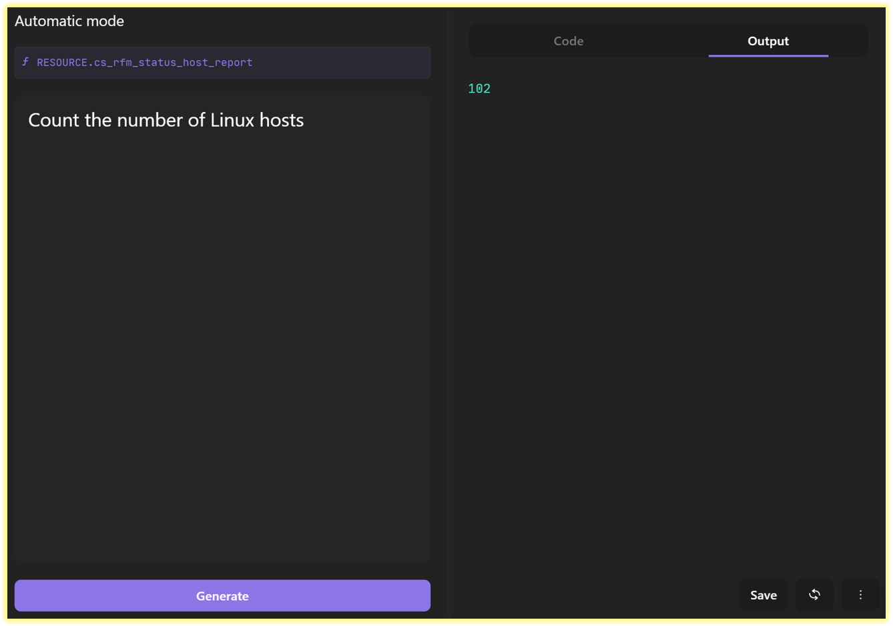
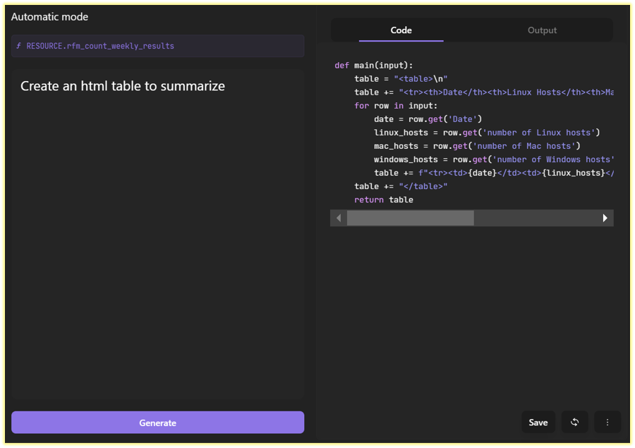

# My six month journey with the Tines SOAR platform.

This past spring, I began my automation journey with the [Tines](https://tines.com) platform.  

I have an System Administration background, with no formal training in coding. I work in Security Operations.  Our portfolio includes Endpoint Detection & Response (EDR), DNS Protection, & Threat Intelligence. 

Recently, our team adopted Tines as our automation platform.

Prior to adopting Tines, the process of shunning IPs on the border firewall, was a time-consuming manual process which involved multiple teams along with inherent delays in the incident ticketing system.  

With the Tines Customer Success Team, we created a [Tines Story](https://www.tines.com/docs/stories/), aka worfklow, where a security analyst can submit malicious IP addresses in a webform.  In less than a minute, the Tines story logs the IP addresses for sunsetting purposes, creates the IP shun list and MD5 hash files, and posts these files to an AWS S3 bucket, so the border firewall can consume the IP shun list as a URL feed.

Wow! I was amazed.

This month long process of co-building the IP shun workflow, with the Tines Customer Success Team, made me realize the power of automation. 

I learned a lot from our Tines Success Engineer, which enabled me to start my learning in earnst.  During the onboarding process, I used the [Tines University](https://www.tines.com/university/) as a training resource.  After graduating from Tines Uni, I started the [Tines Core & Advanced certification](https://www.tines.com/get-certified/).

The certification courses and training provided a solid foundation of knowledge and comfort level with the Tines platform. This past June, I started automating internal SecOps reporting we did in regards to our EDR platforms. 

The CrowdStrike Falcon sensor goes into Reduced Functionality Mode (RFM), usually because the operating system (OS) or kernel version is too old or too new for the sensor to support in kernel mode.  Every week, SecOps would log into the Falcon console, and filter the host management console for endpoints in RFM for the last week.  We would generate the report and download it.  

This report provided data on what kernel update is causing RFM, usually for Linux endpoints.  We would check to see if CrowdStrike released a new Linux sensor version that would support the new kernel version. This weekly report took a security analyst about 20-30 minutes to create and to email the report. Over a year, this report consumed a lot time.

## 25 minutes x 52 weeks = 1,300 minutes or 21 hours!

More importantly, the manual report took us away from other cyber activities.

In Tines, I created a workflow flow that queries the Falcon platform for all endpoints in RFM mode in the last week, collects the host information including kernel version and OS, counts the number of hosts per OS, and emails a summary along with a csv to the SecOps team.  I published this story along with other SecOps workflows, so I can schedule it to run on a weekly basis.

[This summer](https://www.tines.com/you-did-what-with-tines/summer-2024/), Tines had a contest about what workflows you created. I submitted my [CrowdStrike RFM Report Story](https://www.tines.com/library/stories/1257278/?name=generate-a-crowdstrike-rfm-report-with-ai&redirected-from=%2Fyou-did-what-with-tines%2Fsummer-2024%2F). Since I used the Tines [new AI Automatic mode](https://www.tines.com/docs/actions/types/event-transformation/automatic/), the workflow won in the AI Efficiency Category! 

I was quite surprised and grateful that I won.

The event transformation action is responsible for tranforming data to be consumed downstream, or written to a resouce, so another workflow can use the data.  The learning curve for event transformation actions can be challenging since the action uses different functions to slice and dice the data in the workflow.

With AI automatic mode, a security analyst inputs the data to transform and types at the prompt what is needed. After clicking the Generate button, Tines creates the Python code to accomplish the task and outputs the results in seconds.

In the Tines action, the security analyst can verify the output and move on to building the rest of the workflow.

At the end of the workflow, I wanted an html summary to provide an overview of the results.  I do not have a web development background, so I was not sure went into writing code for an html summary.

In the Tines AI Automatic mode, I typed the below prompt and clicked the Generate button!

There is no need to have a Comp Sci degree or extensive coding experience. 

That's why I love the no-low code Tines platform. 

I have the freedom to create workflows in a timely manner without understanding coding, or without maintaining the underlying Python libraries.

I encourage any cybersecurity team to start their automation journey with Tines, since there is no coding experience necessary and the Tines technical support team is excellent.

Try the free [Tines Commmunity Edition](https://www.tines.com/pricing/).

Once you start automating, there is no going back!

Happy Building!!!

Tom

